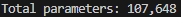
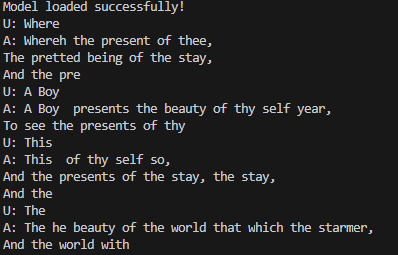
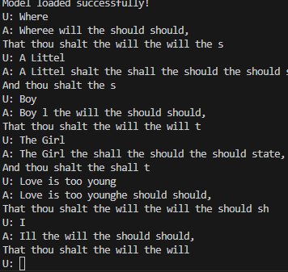
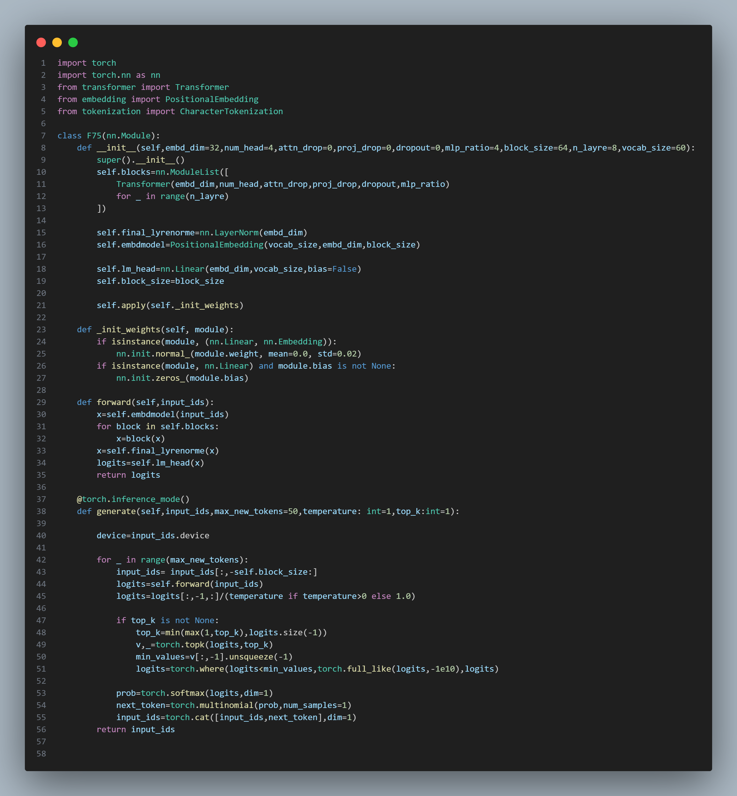

# F75

I was learning to create and test SLM on my new GPU (Nvidia 5060 Ti 16 gb) and during this process i created F75 Model.

## Features
- 107,648 Parameters 
- It learned to spell words 
- Also used Dropout for not overfitting
- 4 head
- 32 embedding dim
- 61 vocab size
- context length 64 (64 char/token)
- 8 layres transformer block
- GPT2 Like family

## How to infrence 
- ### Non dropout model
    - run `python main_infrence.py`
- ### Dropout model
    - replace `dropout=0` to `dropout=0.1` in `main_infrence.py`
    - replace `state = torch.load("f75_shakespeare.pt", map_location=device)` to `state = torch.load("f75_shakespeare_with_dropout.pt", map_location=device)` in `main_infrence.py`
    - run `python main_infrence.py`

## Images
Non Dropout model output

Dropout output

