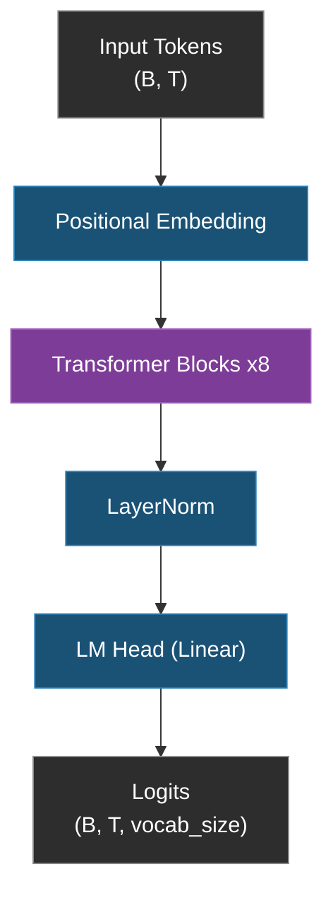
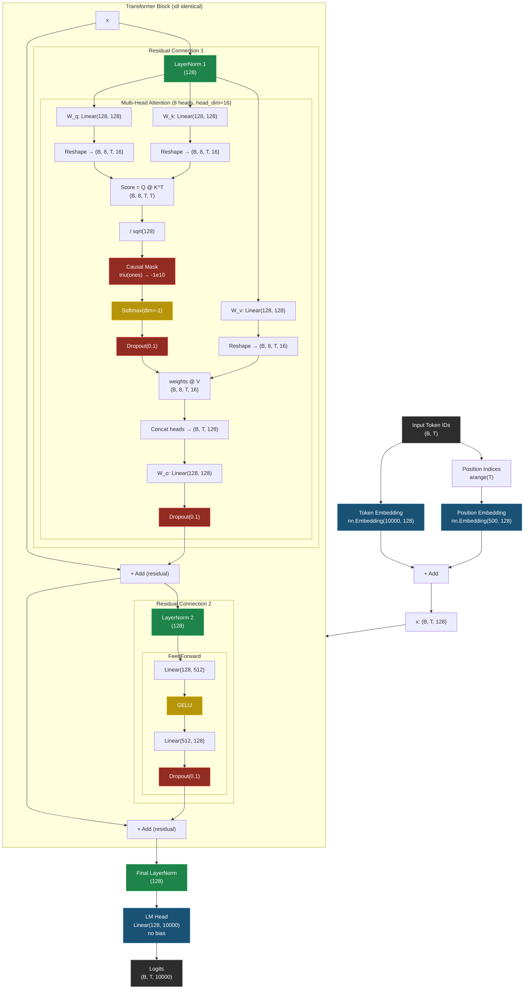

# F75 Model Architecture

## High-Level Flow

```mermaid
flowchart TD
    A["Input Tokens<br/>(B, T)"] --> B["Positional Embedding"]
    B --> C["Transformer Blocks x8"]
    C --> D["LayerNorm"]
    D --> E["LM Head (Linear)"]
    E --> F["Logits<br/>(B, T, vocab_size)"]

    style A fill:#2d2d2d,stroke:#888,color:#fff
    style B fill:#1a5276,stroke:#2980b9,color:#fff
    style C fill:#7d3c98,stroke:#a569bd,color:#fff
    style D fill:#1a5276,stroke:#2980b9,color:#fff
    style E fill:#1a5276,stroke:#2980b9,color:#fff
    style F fill:#2d2d2d,stroke:#888,color:#fff
```

---

## Low-Level Flow (Full Detail)

```mermaid
flowchart TD
    INPUT["Input Token IDs<br/>(B, T)"] --> TOK_EMB["Token Embedding<br/>nn.Embedding(10000, 128)"]
    INPUT --> POS["Position Indices<br/>arange(T)"]
    POS --> POS_EMB["Position Embedding<br/>nn.Embedding(500, 128)"]
    TOK_EMB --> ADD_EMB["+ Add"]
    POS_EMB --> ADD_EMB
    ADD_EMB --> X0["x: (B, T, 128)"]

    X0 --> BLOCK_START

    subgraph BLOCK_START ["Transformer Block (x8 identical)"]
        direction TB

        subgraph RESIDUAL1 ["Residual Connection 1"]
            direction TB
            LN1["LayerNorm 1<br/>(128)"]

            subgraph MHA ["Multi-Head Attention (8 heads, head_dim=16)"]
                direction TB
                WQ["W_q: Linear(128, 128)"]
                WK["W_k: Linear(128, 128)"]
                WV["W_v: Linear(128, 128)"]

                WQ --> RESHAPE_Q["Reshape → (B, 8, T, 16)"]
                WK --> RESHAPE_K["Reshape → (B, 8, T, 16)"]
                WV --> RESHAPE_V["Reshape → (B, 8, T, 16)"]

                RESHAPE_Q --> SCORE["Score = Q @ K^T<br/>(B, 8, T, T)"]
                RESHAPE_K --> SCORE
                SCORE --> SCALE["/ sqrt(128)"]
                SCALE --> MASK["Causal Mask<br/>triu(ones) → -1e10"]
                MASK --> SOFTMAX["Softmax(dim=-1)"]
                SOFTMAX --> ATTN_DROP["Dropout(0.1)"]
                ATTN_DROP --> WEIGHTED["weights @ V<br/>(B, 8, T, 16)"]
                RESHAPE_V --> WEIGHTED
                WEIGHTED --> CONCAT["Concat heads → (B, T, 128)"]
                CONCAT --> WO["W_o: Linear(128, 128)"]
                WO --> PROJ_DROP["Dropout(0.1)"]
            end

            LN1 --> WQ
            LN1 --> WK
            LN1 --> WV
        end

        R1_IN["x"] --> LN1
        R1_IN --> ADD1["+ Add (residual)"]
        PROJ_DROP --> ADD1

        subgraph RESIDUAL2 ["Residual Connection 2"]
            direction TB
            LN2["LayerNorm 2<br/>(128)"]

            subgraph FFN ["FeedForward"]
                direction TB
                FC1["Linear(128, 512)"]
                GELU["GELU"]
                FC2["Linear(512, 128)"]
                FFN_DROP["Dropout(0.1)"]
                FC1 --> GELU --> FC2 --> FFN_DROP
            end

            LN2 --> FC1
        end

        ADD1 --> LN2
        ADD1 --> ADD2["+ Add (residual)"]
        FFN_DROP --> ADD2
    end

    ADD2 --> FINAL_LN["Final LayerNorm<br/>(128)"]
    FINAL_LN --> LM_HEAD["LM Head<br/>Linear(128, 10000)<br/>no bias"]
    LM_HEAD --> LOGITS["Logits<br/>(B, T, 10000)"]

    style INPUT fill:#2d2d2d,stroke:#888,color:#fff
    style LOGITS fill:#2d2d2d,stroke:#888,color:#fff
    style TOK_EMB fill:#1a5276,stroke:#2980b9,color:#fff
    style POS_EMB fill:#1a5276,stroke:#2980b9,color:#fff
    style LN1 fill:#1e8449,stroke:#27ae60,color:#fff
    style LN2 fill:#1e8449,stroke:#27ae60,color:#fff
    style FINAL_LN fill:#1e8449,stroke:#27ae60,color:#fff
    style SOFTMAX fill:#b7950b,stroke:#f1c40f,color:#fff
    style GELU fill:#b7950b,stroke:#f1c40f,color:#fff
    style ATTN_DROP fill:#922b21,stroke:#e74c3c,color:#fff
    style PROJ_DROP fill:#922b21,stroke:#e74c3c,color:#fff
    style FFN_DROP fill:#922b21,stroke:#e74c3c,color:#fff
    style LM_HEAD fill:#1a5276,stroke:#2980b9,color:#fff
    style MASK fill:#922b21,stroke:#e74c3c,color:#fff
```
